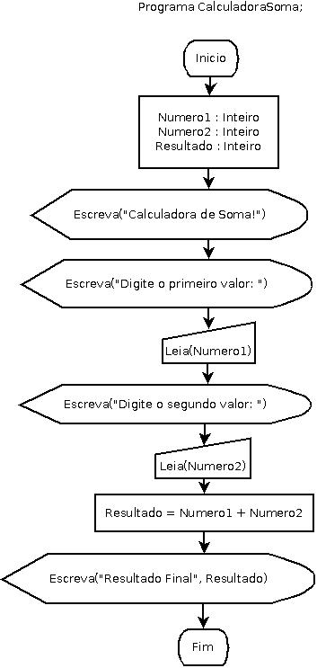

# CalculadoraSomaDiagramadeBlocos

**Calculadora de Soma Em Diagrama de Blocos | Fluxograma**

## Enunciado

**Desenvolver um programa de computador que efetue a leitura de dois valores numéricos inteiros. Processe a operação de adição dos dois valores e apresente na sequência a soma obtida com a operação.**

Autor: Erick Leite Freire 
Criado em: 08-10-2023 
Site: [Escola do Autodidata](https://www.escoladoautodidata.com.br) 
